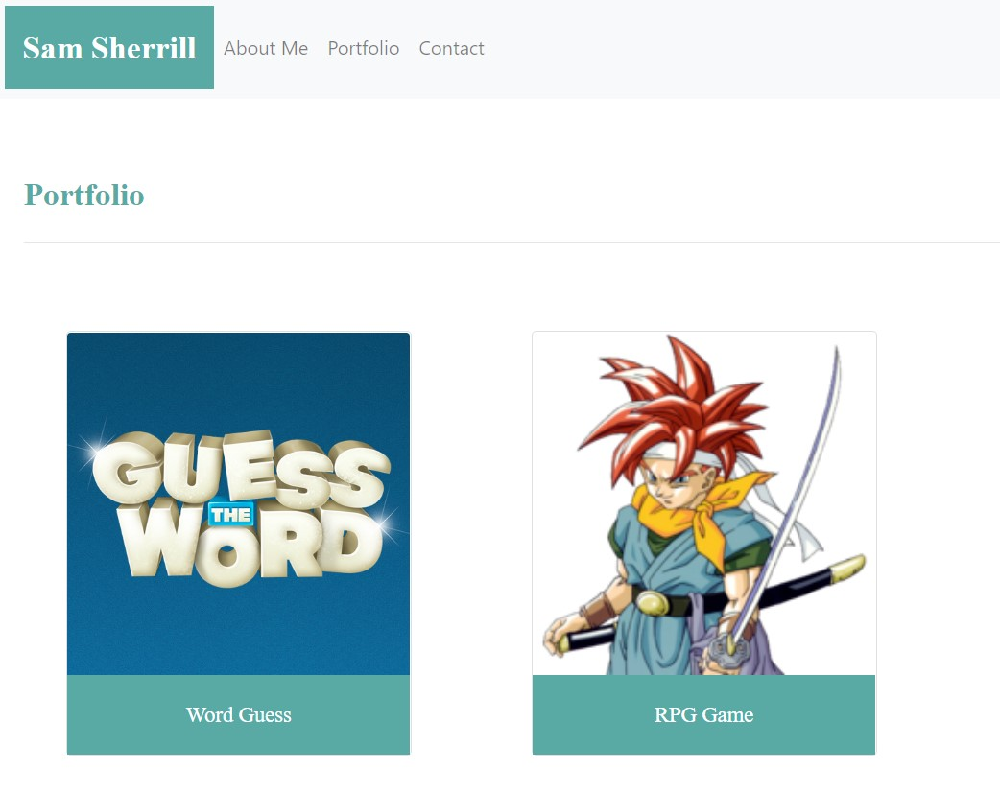

# Unit 02 CSS and Bootstrap Homework: Responsive Portfolio

## Description

As a developer, I will want to have a portfolio online. That portfolio, and all of my work, will have a mobile-first approach. Therefore responsiveness is critical. This practice portfolio demonstrates responsivenss.

## Links

Code Repository:  [https://github.com/SamSherrill/2nd-homework](https://github.com/SamSherrill/2nd-homework)

Deployed Site:  [https://samsherrill.github.io/2nd-homework/index.html](https://samsherrill.github.io/2nd-homework/index.html)